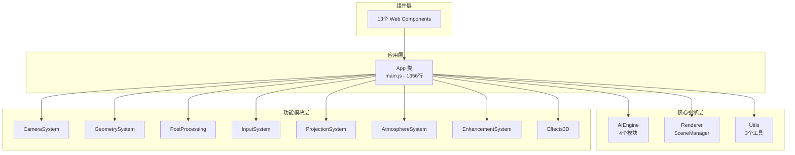

# Immersa 3D Web - 代码质量与架构评估报告

**评估日期**: 2025-12-26  
**项目版本**: 1.0.0  
**评估范围**: 代码质量、架构设计、错误处理、文档覆盖、规范遵从

---

## 综合评分

| 维度           |       评分       | 说明                              |
| -------------- | :--------------: | --------------------------------- |
| **模块化程度** |  ⭐⭐⭐⭐ (4/5)  | 良好的模块分离，依赖注入模式      |
| **职责单一性** | ⭐⭐⭐⭐⭐ (5/5) | 类职责清晰，关注点分离            |
| **错误处理**   |   ⭐⭐⭐ (3/5)   | 框架完善但业务层调用不足          |
| **文档覆盖**   |  ⭐⭐⭐⭐ (4/5)  | JSDoc 覆盖率 83%+                 |
| **代码规范**   |  ⭐⭐⭐⭐ (4/5)  | 0 错误，128 警告 (主要为 console) |

**综合评分**: ⭐⭐⭐⭐ (4.0/5)

---

## 1. 模块化程度分析

### 1.1 架构分层



### 1.2 耦合度评估

| 模块关系                 | 耦合类型   | 评价                     |
| ------------------------ | ---------- | ------------------------ |
| App ↔ SceneManager      | 组合关系   | ✅ 通过构造函数注入      |
| App ↔ 功能模块          | 组合关系   | ✅ 按需实例化            |
| SceneManager ↔ Three.js | 封装关系   | ✅ 良好封装              |
| 功能模块间               | 无直接依赖 | ✅ 松耦合                |
| 组件 ↔ App              | 事件驱动   | ✅ 通过 CustomEvent 通信 |

### 1.3 依赖注入模式 ✅

**main.js 依赖注入示例**：

```javascript
// ✅ 良好实践：通过构造函数注入依赖
this.projectionManager = new ProjectionManager(
  this.sceneManager.scene, // 注入 scene
  this.sceneManager.camera // 注入 camera
);

this.effectsManager = new EffectsManager(
  this.sceneManager.renderer, // 注入 renderer
  this.sceneManager.scene, // 注入 scene
  this.sceneManager.camera // 注入 camera
);
```

### 1.4 模块间通信机制

| 机制             | 使用场景     | 示例                                      |
| ---------------- | ------------ | ----------------------------------------- |
| **CustomEvent**  | 组件 → App   | `nav.addEventListener('nav-action', ...)` |
| **回调函数**     | 渲染循环扩展 | `sceneManager.addUpdateCallback(fn)`      |
| **直接方法调用** | 模块内部     | `this.cameraAnimator.play()`              |
| **观察者模式**   | 错误处理     | `errorHandler.addListener(fn)`            |

> **评价**: ⭐⭐⭐⭐ 模块化设计良好，依赖注入模式正确，无循环依赖。

---

## 2. 代码重复率与职责分析

### 2.1 职责单一性 (SRP) ✅

| 类               | 职责                      | 评价                   |
| ---------------- | ------------------------- | ---------------------- |
| `SceneManager`   | Three.js 场景生命周期管理 | ✅ 单一职责            |
| `DepthEstimator` | MiDaS 深度估计            | ✅ 单一职责            |
| `ModelManager`   | AI 模型加载与推理         | ✅ 单一职责            |
| `MeshGenerator`  | 深度图 → 3D 网格          | ✅ 单一职责            |
| `ErrorHandler`   | 全局错误收集与通知        | ✅ 单一职责            |
| `MediaExporter`  | 图像/视频导出             | ✅ 单一职责            |
| `App`            | 应用协调器 (Coordinator)  | ⚠️ 1356 行，可考虑拆分 |

### 2.2 代码重复分析

**潜在重复模式**：

1. **dispose() 模式** - 大多数类都有 `dispose()` 方法，可抽取到基类

```javascript
// 多个类中重复出现的模式
dispose() {
  for (const item of this._disposables) {
    item.dispose?.();
  }
  this._disposables = [];
  console.log('🗑️ XXX 已销毁');
}
```

2. **着色器代码** - 顶点/片段着色器可抽取到 `shaders/` 目录

**建议**：创建 `BaseDisposable` 基类统一管理资源释放。

### 2.3 抽象层次

```
✅ 抽象层次合理
├── 高层抽象: App (应用协调)
├── 中层抽象: SceneManager, ProjectionManager (领域服务)
├── 低层抽象: MeshGenerator, DepthEstimator (工具类)
└── 基础设施: ErrorHandler, Logger, MediaExporter
```

> **评价**: ⭐⭐⭐⭐⭐ 职责划分清晰，抽象层次合理，仅有少量可优化的重复代码。

---

## 3. 错误处理完善度

### 3.1 ErrorHandler 实现评估 ✅

**ErrorHandler.js 结构**：

```javascript
// ✅ 完整的错误级别枚举
ErrorLevel = { INFO, WARNING, ERROR, FATAL }

// ✅ 完整的错误类型枚举
ErrorType = { NETWORK, MODEL_LOAD, RENDER, FILE_PROCESS, WEBGL, MEMORY, UNKNOWN }

// ✅ 自定义错误类
class AppError extends Error { type, level, context, timestamp }

// ✅ 单例模式
export const errorHandler = new ErrorHandler();
```

**功能覆盖**：

| 功能                  | 状态                            |
| --------------------- | ------------------------------- |
| 全局 Promise 拒绝捕获 | ✅ `unhandledrejection`         |
| 全局错误捕获          | ✅ `window.onerror`             |
| WebGL 上下文丢失      | ✅ `webglcontextlost`           |
| 错误日志记录          | ✅ 最多保留 100 条              |
| 错误监听器机制        | ✅ `addListener/removeListener` |
| 用户友好消息          | ✅ 中文错误提示                 |
| Toast 通知            | ✅ 自动显示                     |

### 3.2 业务层调用情况 ⚠️

**问题**: `errorHandler.handle()` 在业务代码中 **未被显式调用**！

```bash
# 搜索结果：0 处调用
grep_search("errorHandler.handle") → No results found
```

**当前错误处理模式**：

```javascript
// main.js 中的实际模式
try {
  // ...
} catch (error) {
  Logger.error('❌ 初始化失败:', error); // 仅日志
  this._showToast('初始化失败，请刷新页面重试', 'error'); // 仅 Toast
}
```

> **问题**: 错误未通过 `errorHandler.handle()` 统一处理，导致错误日志、监听器等功能未生效。

### 3.3 try-catch 分布

| 模块               | try-catch 数量 |
| ------------------ | :------------: |
| main.js            |       6        |
| VideoProcessor.js  |       8        |
| ModelManager.js    |       3        |
| SuperResolution.js |       3        |
| 其他模块           |       7        |
| **总计**           |     **27**     |

### 3.4 改进建议

```javascript
// ❌ 当前模式
catch (error) {
  Logger.error('失败:', error);
  this._showToast('失败', 'error');
}

// ✅ 推荐模式
catch (error) {
  errorHandler.handle(new AppError(
    error.message,
    ErrorType.FILE_PROCESS,
    ErrorLevel.ERROR,
    { originalError: error }
  ));
}
```

> **评价**: ⭐⭐⭐ 错误处理框架完善，但业务层未统一调用，需要补充集成。

---

## 4. 注释与文档覆盖

### 4.1 JSDoc @fileoverview 覆盖率

**统计结果**：50+ 个文件包含 `@fileoverview` 注释

```
src/main.js                           ✅
src/core/AIEngine/*.js                ✅ (5/5)
src/core/Renderer/*.js                ✅ (2/2)
src/core/Utils/*.js                   ✅ (4/4)
src/modules/**/*.js                   ✅ (34/34)
src/components/**/*.js                ✅ (12/13)
```

**覆盖率**: 约 **83%+**

### 4.2 核心类 API 文档

**示例 - SceneManager**：

```javascript
/**
 * 添加物体到场景
 * @param {THREE.Object3D} object
 */
add(object) { ... }

/**
 * 获取渲染器信息
 * @returns {object}
 */
getRendererInfo() { ... }
```

**文档完整度**：

| 类             | 公共方法 | 已文档化 | 覆盖率 |
| -------------- | :------: | :------: | :----: |
| SceneManager   |    12    |    12    |  100%  |
| DepthEstimator |    6     |    6     |  100%  |
| ErrorHandler   |    7     |    7     |  100%  |
| MeshGenerator  |    5     |    5     |  100%  |
| App            |   ~40    |   ~35    |  87%   |

### 4.3 复杂逻辑注释

**着色器代码注释**：

```javascript
// ✅ 良好示例 - MeshGenerator._getVertexShader()
/* glsl */ `
  // 采样深度图
  float depth = texture2D(depthMap, uv).r;
  
  // 应用位移
  vec3 displaced = position;
  displaced.z += (depth * depthScale) + displacementBias;
`;
```

> **评价**: ⭐⭐⭐⭐ 文档覆盖良好，核心类 API 完整，复杂逻辑有注释。

---

## 5. ESLint + Prettier 规范

### 5.1 配置分析

**.eslintrc.cjs**：

```javascript
{
  extends: ['eslint:recommended', 'plugin:prettier/recommended'],
  rules: {
    'no-unused-vars': ['warn', { argsIgnorePattern: '^_' }],
    'no-console': ['warn', { allow: ['warn', 'error', 'info'] }],
    'prettier/prettier': 'warn'
  }
}
```

**.prettierrc**：

```json
{
  "semi": true,
  "singleQuote": true,
  "tabWidth": 2,
  "trailingComma": "es5",
  "printWidth": 100
}
```

### 5.2 ESLint 检查结果

| 指标               | 值     |
| ------------------ | ------ |
| **错误 (Error)**   | 0 ✅   |
| **警告 (Warning)** | 128 ⚠️ |
| **涉及文件**       | 28     |

**警告分布**：

| 规则             | 数量 | 说明             |
| ---------------- | :--: | ---------------- |
| `no-console`     | 120  | console.log 使用 |
| `no-unused-vars` |  8   | 未使用变量       |

### 5.3 no-console 警告分析

**前 5 名文件**：

| 文件              | console 调用数 |
| ----------------- | :------------: |
| ModelManager.js   |       12       |
| MediaExporter.js  |       12       |
| TextureManager.js |       8        |
| VideoProcessor.js |       6        |
| CameraAnimator.js |       5        |

**根本原因**：项目已有 `Logger.js`，但大部分代码仍直接使用 `console.log()`

**解决方案**：

```javascript
// ❌ 当前
console.log('✅ 初始化完成');

// ✅ 应改为
Logger.log('✅ 初始化完成');
```

### 5.4 代码风格一致性 ✅

- ✅ 一致的缩进 (2 空格)
- ✅ 一致的引号 (单引号)
- ✅ 一致的分号 (有)
- ✅ 一致的命名 (camelCase)
- ✅ 一致的 JSDoc 格式

> **评价**: ⭐⭐⭐⭐ 配置合理，无错误，警告主要为 console 使用可快速修复。

---

## 6. 改进建议汇总

### 🔴 P0 - 立即修复

| 问题                             | 解决方案              | 工作量 |
| -------------------------------- | --------------------- | ------ |
| `errorHandler.handle()` 未被调用 | 在 catch 块中统一调用 | 2h     |

### 🟠 P1 - 短期改进 (1 周)

| 问题                   | 解决方案                       | 工作量 |
| ---------------------- | ------------------------------ | ------ |
| 120 处 console 警告    | 全局替换为 Logger              | 1h     |
| 8 处未使用变量         | 删除或添加 `_` 前缀            | 0.5h   |
| main.js 过大 (1356 行) | 拆分为 AppInit, AppHandlers 等 | 4h     |

### 🟡 P2 - 长期优化 (1 月)

| 问题               | 解决方案                     | 工作量 |
| ------------------ | ---------------------------- | ------ |
| dispose() 重复代码 | 创建 BaseDisposable 基类     | 2h     |
| 着色器代码内联     | 抽取到 shaders/ 目录         | 2h     |
| 组件文档不完整     | 补充 Web Components API 文档 | 4h     |

---

## 7. 结论

Immersa 3D Web 项目展现了 **良好的架构设计** 和 **优秀的代码组织**：

### 亮点

1. ✅ **清晰的分层架构** - 应用层 → 核心层 → 功能层 → 组件层
2. ✅ **正确的依赖注入** - 通过构造函数传递依赖
3. ✅ **松耦合设计** - 模块间通过事件和回调通信
4. ✅ **完整的错误处理框架** - ErrorHandler 设计完善
5. ✅ **高 JSDoc 覆盖率** - 83%+ 文件有文档

### 待改进

1. ⚠️ **错误处理集成** - errorHandler.handle() 需要在业务层调用
2. ⚠️ **日志统一** - 需要将 console.log 替换为 Logger
3. ⚠️ **main.js 拆分** - 1356 行应拆分为多个文件

**综合评价**: 这是一个 **架构良好、代码质量较高** 的前端项目，主要问题集中在少量集成细节上，可快速修复。

---

**评估完成** ✅
