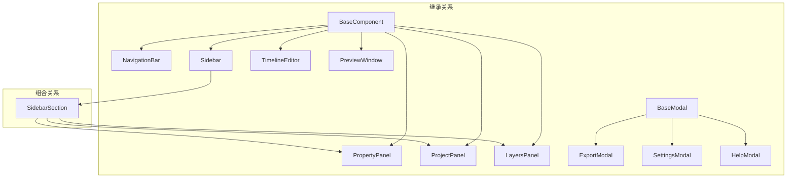

# Immersa 3D Web - 组件集成状态检查报告

**检查日期**: 2025-12-26  
**项目版本**: 1.0.0

---

## 综合评估

| 维度                    |  状态   | 说明                       |
| ----------------------- | :-----: | -------------------------- |
| **Web Components 注册** | ✅ 完整 | 12 个组件全部注册          |
| **Web Components 使用** | ⚠️ 部分 | 10/12 在 HTML 中使用       |
| **功能模块导入**        | ⚠️ 部分 | 8 个系统，部分子模块未集成 |
| **模态框触发机制**      | ✅ 完整 | 3 个模态框均有触发         |

---

## 一、Web Components 注册与使用检查

### 1.1 组件注册清单

| 组件类         | 标签名              | 已注册 | 注册位置              |
| -------------- | ------------------- | :----: | --------------------- |
| NavigationBar  | `<navigation-bar>`  |   ✅   | NavigationBar.js:121  |
| Sidebar        | `<app-sidebar>`     |   ✅   | Sidebar.js:184        |
| SidebarSection | `<sidebar-section>` |   ✅   | Sidebar.js:185        |
| ProjectPanel   | `<project-panel>`   |   ✅   | ProjectPanel.js:253   |
| LayersPanel    | `<layers-panel>`    |   ✅   | LayersPanel.js:153    |
| PropertyPanel  | `<property-panel>`  |   ✅   | PropertyPanel.js:323  |
| TimelineEditor | `<timeline-editor>` |   ✅   | TimelineEditor.js:230 |
| PreviewWindow  | `<preview-window>`  |   ✅   | PreviewWindow.js:340  |
| BaseModal      | `<base-modal>`      |   ✅   | BaseModal.js:187      |
| ExportModal    | `<export-modal>`    |   ✅   | ExportModal.js:184    |
| SettingsModal  | `<settings-modal>`  |   ✅   | SettingsModal.js:115  |
| HelpModal      | `<help-modal>`      |   ✅   | HelpModal.js:108      |

### 1.2 组件使用情况 (index.html)

```html
<!-- ✅ 已使用的组件 -->
<navigation-bar id="main-nav"></navigation-bar>
<app-sidebar position="left">
  <sidebar-section title="项目">
    <project-panel id="project-panel"></project-panel>
  </sidebar-section>
  <sidebar-section title="图层">
    <layers-panel id="layers-panel"></layers-panel>
  </sidebar-section>
</app-sidebar>
<app-sidebar position="right">
  <sidebar-section title="属性">
    <property-panel id="main-properties"></property-panel>
  </sidebar-section>
</app-sidebar>
<timeline-editor id="timeline-editor"></timeline-editor>
<export-modal id="export-modal"></export-modal>
<settings-modal id="settings-modal"></settings-modal>
<help-modal id="help-modal"></help-modal>
```

### 1.3 未使用的组件

| 组件          | 标签名             | 状态          | 原因                                 |
| ------------- | ------------------ | ------------- | ------------------------------------ |
| PreviewWindow | `<preview-window>` | ⚠️ 未使用     | DOM 中未找到。可能为备用组件或待集成 |
| BaseModal     | `<base-modal>`     | ⚠️ 未直接使用 | 作为基类被继承，不需要直接使用       |

> **说明**: `BaseModal` 作为抽象基类设计是合理的。`PreviewWindow` 需要确认是否需要集成。

### 1.4 组件依赖关系



**依赖关系评价**: ✅ 合理的继承和组合模式

---

## 二、模块启用状态检查

### 2.1 模块导入矩阵 (main.js)

| 模块系统              | 子模块             | 已导入 | 已实例化 | 已使用 |
| --------------------- | ------------------ | :----: | :------: | :----: |
| **AtmosphereSystem**  | ParticleSystem     |   ✅   |    ✅    |   ✅   |
|                       | SkyController      |   ✅   |    ✅    |   ✅   |
|                       | LightingManager    |   ✅   |    ✅    |   ✅   |
|                       | FogController      |   ❌   |    ❌    |   ❌   |
| **CameraSystem**      | CameraAnimator     |   ✅   |    ✅    |   ✅   |
|                       | CameraPath         |   ✅   |    ✅    |   ✅   |
| **Effects3D**         | StereoRenderer     |   ✅   |    ✅    |   ✅   |
|                       | ParallaxManager    |   ❌   |    ❌    |   ❌   |
| **EnhancementSystem** | SuperResolution    |   ❌   |    ❌    |   ❌   |
|                       | FrameInterpolation |   ❌   |    ❌    |   ❌   |
| **GeometrySystem**    | MeshGenerator      |   ✅   |    ✅    |   ✅   |
|                       | MaterialEditor     |   ❌   |    ❌    |   ❌   |
|                       | TextureManager     |   ❌   |    ❌    |   ❌   |
|                       | PointCloud         |   ❌   |    ❌    |   ❌   |
| **InputSystem**       | ImageProcessor     |   ✅   |    ✅    |   ✅   |
|                       | VideoProcessor     |   ❌   |    ❌    |   ❌   |
|                       | DragDropHandler    |   ❌   |    ❌    |   ❌   |
| **PostProcessing**    | EffectsManager     |   ✅   |    ✅    |   ✅   |
|                       | EffectsStack       |   ❌   |    ❌    |   ❌   |
|                       | LUTManager         |   ❌   |    ❌    |   ❌   |
| **ProjectionSystem**  | ProjectionManager  |   ✅   |    ✅    |   ✅   |
|                       | 各 Projector       |   ⚪   |    ⚪    |   ⚪   |

> ⚪ 表示通过 ProjectionManager 间接使用

### 2.2 模块集成详情

#### AtmosphereSystem ⭐⭐⭐⭐ (4/5)

| 子模块          | 状态      | 说明                        |
| --------------- | --------- | --------------------------- |
| ParticleSystem  | ✅ 已集成 | 粒子效果 (雪、雨、萤火虫等) |
| SkyController   | ✅ 已集成 | 天气预设、时间控制          |
| LightingManager | ✅ 已集成 | 光照预设                    |
| FogController   | ❌ 未集成 | 雾效功能未暴露给用户        |

#### CameraSystem ⭐⭐⭐⭐⭐ (5/5)

| 子模块         | 状态      | 说明             |
| -------------- | --------- | ---------------- |
| CameraAnimator | ✅ 已集成 | 相机动画类型控制 |
| CameraPath     | ✅ 已集成 | 关键帧路径动画   |

#### Effects3D ⭐⭐⭐ (3/5)

| 子模块          | 状态      | 说明                          |
| --------------- | --------- | ----------------------------- |
| StereoRenderer  | ✅ 已集成 | 立体渲染 (红青3D、左右分屏等) |
| ParallaxManager | ❌ 未集成 | 视差效果管理未暴露            |

#### EnhancementSystem ⭐ (1/5)

| 子模块             | 状态      | 说明                  |
| ------------------ | --------- | --------------------- |
| SuperResolution    | ❌ 未集成 | AI 超分辨率功能未启用 |
| FrameInterpolation | ❌ 未集成 | 帧插值功能未启用      |

#### GeometrySystem ⭐⭐ (2/5)

| 子模块         | 状态      | 说明               |
| -------------- | --------- | ------------------ |
| MeshGenerator  | ✅ 已集成 | 深度图 → 3D 网格   |
| MaterialEditor | ❌ 未集成 | 材质编辑 UI 未暴露 |
| TextureManager | ❌ 未集成 | 纹理管理未暴露     |
| PointCloud     | ❌ 未集成 | 点云渲染未启用     |

#### InputSystem ⭐⭐ (2/5)

| 子模块          | 状态      | 说明                   |
| --------------- | --------- | ---------------------- |
| ImageProcessor  | ✅ 已集成 | 图像加载处理           |
| VideoProcessor  | ❌ 未集成 | 视频处理未启用         |
| DragDropHandler | ❌ 未集成 | 通过 ProjectPanel 替代 |

#### PostProcessing ⭐⭐⭐ (3/5)

| 子模块         | 状态          | 说明                       |
| -------------- | ------------- | -------------------------- |
| EffectsManager | ✅ 已集成     | 后处理效果管理             |
| EffectsStack   | ❌ 未直接集成 | 内部由 EffectsManager 使用 |
| LUTManager     | ❌ 未集成     | LUT 色彩预设未暴露         |

#### ProjectionSystem ⭐⭐⭐⭐⭐ (5/5)

| 子模块            | 状态        | 说明                        |
| ----------------- | ----------- | --------------------------- |
| ProjectionManager | ✅ 已集成   | 投影模式控制                |
| 各 Projector      | ⚪ 间接使用 | 通过 ProjectionManager 调用 |

---

## 三、模态框触发机制检查

### 3.1 触发机制

| 模态框        | 触发方式           | 代码位置                               |
| ------------- | ------------------ | -------------------------------------- |
| ExportModal   | 导航栏 "导出" 按钮 | main.js `_handleNavAction('export')`   |
| SettingsModal | 导航栏 "设置" 按钮 | main.js `_handleNavAction('settings')` |
| HelpModal     | 导航栏 "帮助" 按钮 | main.js `_handleNavAction('help')`     |

### 3.2 触发代码

```javascript
// main.js _handleNavAction()
case 'export':
  document.getElementById('export-modal')?.open();
  break;
case 'settings':
  document.getElementById('settings-modal')?.open();
  break;
case 'help':
  document.getElementById('help-modal')?.open();
  break;
```

**评价**: ✅ 三个模态框均有完整的触发机制

---

## 四、未集成模块汇总

### 4.1 完全未集成的模块

| 模块              | 子模块             | 功能        | 建议优先级 |
| ----------------- | ------------------ | ----------- | :--------: |
| EnhancementSystem | SuperResolution    | AI 超分辨率 |   🔴 P1    |
| EnhancementSystem | FrameInterpolation | 帧插值      |   🟠 P2    |
| InputSystem       | VideoProcessor     | 视频处理    |   🔴 P1    |
| GeometrySystem    | PointCloud         | 点云渲染    |   🟡 P3    |
| GeometrySystem    | MaterialEditor     | 材质编辑    |   🟡 P3    |
| AtmosphereSystem  | FogController      | 雾效控制    |   🟡 P3    |
| PostProcessing    | LUTManager         | LUT 预设    |   🟠 P2    |

### 4.2 部分集成的模块

| 模块           | 已集成功能     | 缺失功能                                   |
| -------------- | -------------- | ------------------------------------------ |
| Effects3D      | StereoRenderer | ParallaxManager                            |
| GeometrySystem | MeshGenerator  | MaterialEditor, TextureManager, PointCloud |
| PostProcessing | EffectsManager | LUTManager (需要 UI 暴露)                  |

---

## 五、改进建议

### 🔴 P1 - 优先集成 (影响核心功能)

| 模块            | 动作                       | 工作量 |
| --------------- | -------------------------- | ------ |
| VideoProcessor  | 添加视频上传和处理流程     | 4h     |
| SuperResolution | 添加超分辨率开关到属性面板 | 2h     |

### 🟠 P2 - 短期集成 (增强用户体验)

| 模块               | 动作                          | 工作量 |
| ------------------ | ----------------------------- | ------ |
| LUTManager         | 添加 LUT 预设选择到后期处理组 | 2h     |
| FrameInterpolation | 添加帧插值开关到增强设置      | 2h     |

### 🟡 P3 - 长期集成 (进阶功能)

| 模块               | 动作                   | 工作量 |
| ------------------ | ---------------------- | ------ |
| PreviewWindow 组件 | 确认是否需要集成或删除 | 1h     |
| PointCloud         | 添加点云渲染模式       | 3h     |
| MaterialEditor     | 添加材质编辑面板       | 4h     |
| FogController      | 添加雾效控制到氛围设置 | 2h     |

---

## 六、组件导入建议

### 当前 main.js 导入

```javascript
// 已导入
import { ImageProcessor } from './modules/InputSystem/ImageProcessor.js';
import { MeshGenerator } from './modules/GeometrySystem/MeshGenerator.js';
// ... (其他已导入)

// ❌ 建议添加
import { VideoProcessor } from './modules/InputSystem/VideoProcessor.js';
import { SuperResolution } from './modules/EnhancementSystem/SuperResolution.js';
import { LUTManager } from './modules/PostProcessing/LUTManager.js';
import { FogController } from './modules/AtmosphereSystem/FogController.js';
```

---

## 七、结论

| 分类               | 状态             | 总结                           |
| ------------------ | ---------------- | ------------------------------ |
| **Web Components** | ⭐⭐⭐⭐ (4/5)   | 12 个组件注册完整，10 个在使用 |
| **功能模块**       | ⭐⭐⭐ (3/5)     | 核心功能已集成，进阶功能待完善 |
| **模态框**         | ⭐⭐⭐⭐⭐ (5/5) | 触发机制完整                   |

### 关键发现

1. ✅ **核心功能完整**: 3D 渲染、深度估计、基础后处理、立体渲染均可用
2. ⚠️ **视频处理缺失**: VideoProcessor 已实现但未集成到 main.js
3. ⚠️ **AI 增强未启用**: SuperResolution、FrameInterpolation 完全未使用
4. ⚠️ **高级功能隐藏**: MaterialEditor、LUTManager、PointCloud 等功能已实现但未暴露给用户

**建议**: 优先集成 VideoProcessor 和 SuperResolution，这是产品描述中的核心功能。

---

**检查完成** ✅
