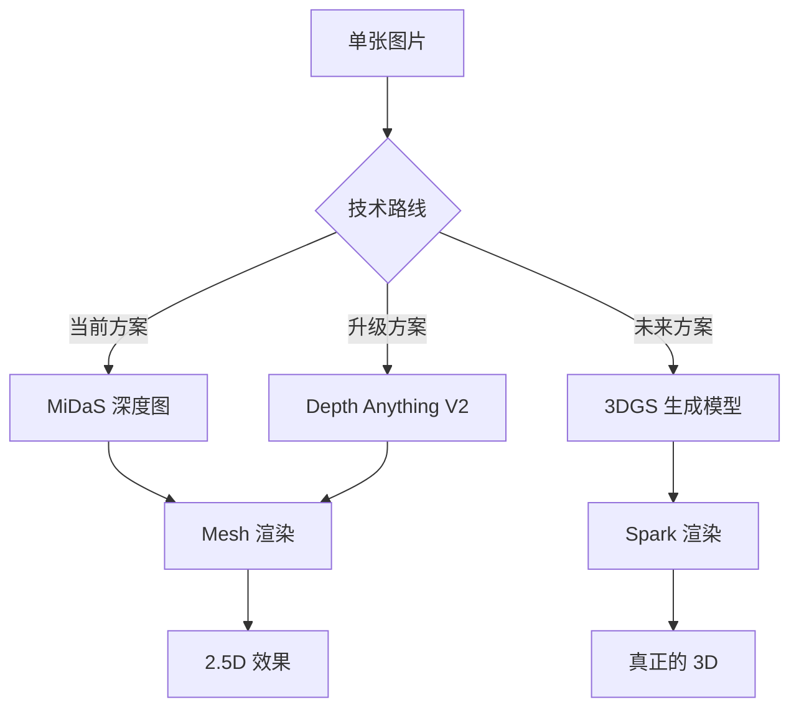

# 🌐 GitHub 技术生态开源项目综合研究报告

**研究日期**: 2025-12-26  
**研究范围**: 高斯泼溅技术 + Immersa 3D 核心技术栈

---

## 一、高斯泼溅技术 (Gaussian Splatting)

### 1.1 核心/原版实现

| 项目                                                                                        | 描述             | 论文/会议     | 推荐度     |
| ------------------------------------------------------------------------------------------- | ---------------- | ------------- | ---------- |
| [graphdeco-inria/gaussian-splatting](https://github.com/graphdeco-inria/gaussian-splatting) | **官方原版实现** | SIGGRAPH 2023 | ⭐⭐⭐⭐⭐ |

### 1.2 4D 动态场景

| 项目                                                                                  | 描述             | 论文/会议 | 推荐度     |
| ------------------------------------------------------------------------------------- | ---------------- | --------- | ---------- |
| [hustvl/4DGaussians](https://github.com/hustvl/4DGaussians)                           | 实时动态场景渲染 | CVPR 2024 | ⭐⭐⭐⭐⭐ |
| [fudan-zvg/4d-gaussian-splatting](https://github.com/fudan-zvg/4d-gaussian-splatting) | 4D 高斯泼溅      | ICLR 2024 | ⭐⭐⭐⭐   |

### 1.3 单图/少图生成 3DGS

| 项目                                                                                  | 描述                   | 论文/会议  | 推荐度     |
| ------------------------------------------------------------------------------------- | ---------------------- | ---------- | ---------- |
| [apple/ml-sharp](https://github.com/apple/ml-sharp)                                   | Apple SHARP，单图转 3D | arXiv 2024 | ⭐⭐⭐⭐⭐ |
| [caiyuanhao1998/Open-DiffusionGS](https://github.com/caiyuanhao1998/Open-DiffusionGS) | 扩散模型 + 3DGS        | ICCV 2025  | ⭐⭐⭐⭐   |
| [gsgen3d/gsgen](https://github.com/gsgen3d/gsgen)                                     | 文本转 3D 高斯泼溅     | CVPR 2024  | ⭐⭐⭐⭐   |

### 1.4 Web 浏览器渲染器 ⭐ 重点

| 项目                                                                        | 描述                          | 技术栈          | 推荐度     |
| --------------------------------------------------------------------------- | ----------------------------- | --------------- | ---------- |
| [sparkjsdev/spark](https://github.com/sparkjsdev/spark)                     | **高级 Three.js 3DGS 渲染器** | Three.js + WASM | ⭐⭐⭐⭐⭐ |
| [mkkellogg/GaussianSplats3D](https://github.com/mkkellogg/GaussianSplats3D) | Three.js 3DGS 实现            | Three.js        | ⭐⭐⭐⭐   |
| [huggingface/gsplat.js](https://github.com/huggingface/gsplat.js)           | Hugging Face 官方 JS 库       | WebGL + WASM    | ⭐⭐⭐⭐   |
| [LiXin97/gaussian-viewer](https://github.com/LiXin97/gaussian-viewer)       | 轻量级 WebGL 查看器           | WebGL           | ⭐⭐⭐     |

---

## 二、深度估计 (Depth Estimation)

| 项目                                                                                                          | 描述                           | 技术栈          | 推荐度     |
| ------------------------------------------------------------------------------------------------------------- | ------------------------------ | --------------- | ---------- |
| [akbartus/DepthAnything-on-Browser](https://github.com/akbartus/DepthAnything-on-Browser)                     | **Depth Anything V2 浏览器版** | ONNX + Three.js | ⭐⭐⭐⭐⭐ |
| [kuromadara/live-depth-prediction-using-tfjs](https://github.com/kuromadara/live-depth-prediction-using-tfjs) | MiDaS 实时深度预测             | TensorFlow.js   | ⭐⭐⭐⭐   |
| [MartinDelophy/depth-anything-quantize](https://github.com/MartinDelophy/depth-anything-quantize)             | Depth Anything ONNX 量化版     | ONNX            | ⭐⭐⭐⭐   |

---

## 三、AI/ML 浏览器推理

### 3.1 ONNX Runtime Web

| 项目                                                                                        | 描述                   | 用途     |
| ------------------------------------------------------------------------------------------- | ---------------------- | -------- |
| [ramompraga/yolov12-onnxruntime-web](https://github.com/ramompraga/yolov12-onnxruntime-web) | YOLOv12 浏览器目标检测 | 参考实现 |

### 3.2 TensorFlow.js

| 项目                                                  | 描述                 | 用途     |
| ----------------------------------------------------- | -------------------- | -------- |
| [tensorflow/tfjs](https://github.com/tensorflow/tfjs) | 官方库               | 核心依赖 |
| 多个图像分类项目                                      | MobileNet 浏览器分类 | 参考实现 |

---

## 四、视频处理 (FFmpeg WASM)

| 项目                                                                      | 描述                        | 推荐度     |
| ------------------------------------------------------------------------- | --------------------------- | ---------- |
| [ffmpegwasm/ffmpeg.wasm](https://github.com/ffmpegwasm/ffmpeg.wasm)       | **官方 FFmpeg WASM**        | ⭐⭐⭐⭐⭐ |
| [mkdirprince/useFFmpeg](https://github.com/mkdirprince/useFFmpeg)         | React Hook 封装             | ⭐⭐⭐⭐   |
| [Ye-HHH/FileConverter](https://github.com/Ye-HHH/FileConverter)           | 纯前端格式转换工具          | ⭐⭐⭐⭐   |
| [wrahmani/deepGuard-verify](https://github.com/wrahmani/deepGuard-verify) | TF.js + FFmpeg 深度伪造检测 | ⭐⭐⭐     |

---

## 五、Three.js 生态

### 5.1 相机控制

| 项目                                                                                    | 描述                   | 推荐度     |
| --------------------------------------------------------------------------------------- | ---------------------- | ---------- |
| [cognitedata/three-combo-controls](https://github.com/cognitedata/three-combo-controls) | Orbit + 第一人称控制器 | ⭐⭐⭐⭐   |
| Three.js 内置 OrbitControls                                                             | 轨道控制               | ⭐⭐⭐⭐⭐ |

### 5.2 后处理效果

| 项目                         | 描述           | 推荐度     |
| ---------------------------- | -------------- | ---------- |
| pmndrs/postprocessing        | 高性能后处理库 | ⭐⭐⭐⭐⭐ |
| Three.js 内置 EffectComposer | 效果合成器     | ⭐⭐⭐⭐   |

---

## 六、对 Immersa 3D 的建议

### 🎯 最高优先级集成

| 序号 | 项目                  | 理由                     | 工作量 |
| ---- | --------------------- | ------------------------ | ------ |
| 1    | **Depth Anything V2** | 替代 MiDaS，深度更精确   | 1-2 周 |
| 2    | **Spark**             | 3DGS 渲染，支持 98% 设备 | 2-3 周 |
| 3    | **useFFmpeg**         | 简化视频处理代码         | 0.5 周 |

### 📚 学习参考

| 序号 | 项目                             | 学习内容           |
| ---- | -------------------------------- | ------------------ |
| 1    | FileConverter                    | 纯前端文件转换架构 |
| 2    | live-depth-prediction-using-tfjs | TF.js + MiDaS 集成 |
| 3    | 4DGaussians                      | 动态场景技术前沿   |

### 🔮 长期关注

| 序号 | 方向          | 项目                          |
| ---- | ------------- | ----------------------------- |
| 1    | 单图生成 3DGS | Open-DiffusionGS, Apple SHARP |
| 2    | 文本转 3D     | gsgen                         |
| 3    | 语义 3D       | LangSplat                     |

---

## 七、技术趋势总结

**核心结论**：

1. **短期**：用 Depth Anything V2 提升深度图质量
2. **中期**：用 Spark 支持 3DGS 文件查看
3. **长期**：关注 Open-DiffusionGS 等端到端生成模型
