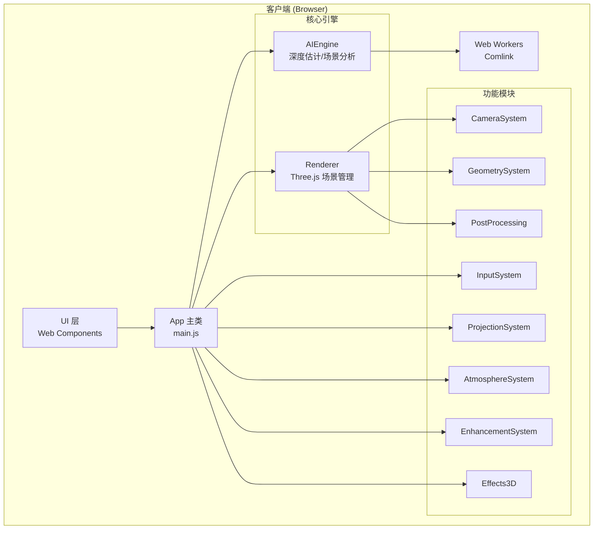

# Immersa 3D Web - 项目详细技术文档

**生成日期**: 2025-12-26  
**项目版本**: 1.0.0  
**许可证**: MIT

---

## 目录

1. [项目概述](#项目概述)
2. [项目类型与架构](#项目类型与架构)
3. [技术栈详解](#技术栈详解)
4. [构建工具与配置](#构建工具与配置)
5. [项目结构](#项目结构)
6. [核心模块详解](#核心模块详解)
7. [组件系统](#组件系统)
8. [设计系统与样式](#设计系统与样式)
9. [PWA 配置](#pwa-配置)
10. [测试覆盖](#测试覆盖)
11. [性能与质量评估](#性能与质量评估)
12. [已知问题与改进建议](#已知问题与改进建议)

---

## 项目概述

**Immersa 3D** 是一个 AI 驱动的 3D 内容创作工具，允许用户将 2D 图像/视频智能转换为沉浸式 3D 体验。整个应用完全运行在浏览器端，无需服务端支持。

### 核心功能

| 功能           | 描述                             |
| -------------- | -------------------------------- |
| **深度估计**   | 使用 MiDaS 模型进行单目深度估计  |
| **3D 渲染**    | 基于 Three.js 的实时 3D 场景渲染 |
| **后处理效果** | Bloom、DOF、色彩分级等视觉增强   |
| **时间轴编辑** | 动画和关键帧控制                 |
| **视频导出**   | 使用 FFmpeg.wasm 进行视频编码    |
| **离线支持**   | PWA 架构，支持离线使用           |

---

## 项目类型与架构

### 项目类型矩阵

| 类型                      | 状态 | 详细说明                           |
| ------------------------- | :--: | ---------------------------------- |
| **SPA (单页应用)**        |  ✅  | 单一 `index.html` 入口，客户端路由 |
| **PWA (渐进式 Web 应用)** |  ✅  | Service Worker + Web App Manifest  |
| **静态网站**              |  ❌  | 具有复杂交互逻辑                   |
| **SSR (服务端渲染)**      |  ❌  | 纯客户端渲染 (CSR)                 |
| **SSG (静态站点生成)**    |  ❌  | 无预渲染                           |

### 架构图



---

## 技术栈详解

### 核心技术

| 类别                   | 技术                          | 版本                 | 用途                   |
| ---------------------- | ----------------------------- | -------------------- | ---------------------- |
| **语言**               | JavaScript (ES Modules)       | ES2022+              | 无框架，纯 JS          |
| **3D 渲染**            | Three.js                      | `0.170.0`            | WebGL/WebGPU 场景渲染  |
| **AI/ML - TensorFlow** | @tensorflow/tfjs              | `4.22.0`             | 机器学习推理           |
| **AI/ML - ONNX**       | onnxruntime-web               | `1.20.0`             | ONNX 模型推理（MiDaS） |
| **视频处理**           | @ffmpeg/ffmpeg + @ffmpeg/util | `0.12.10` / `0.12.1` | 浏览器端视频编解码     |
| **动画**               | GSAP                          | `3.12.5`             | 高性能 DOM/WebGL 动画  |
| **并发通信**           | Comlink                       | `4.4.1`              | Web Worker 简化 RPC    |

### UI 技术

| 类别       | 技术                             | 说明                      |
| ---------- | -------------------------------- | ------------------------- |
| **组件化** | Web Components (Custom Elements) | 原生浏览器组件            |
| **样式**   | Vanilla CSS                      | 无 TailwindCSS 或预处理器 |
| **字体**   | Google Fonts (Inter)             | 现代无衬线字体            |
| **图标**   | Emoji                            | 内联 Emoji 符号           |

### 依赖清单

```json
{
  "dependencies": {
    "@ffmpeg/ffmpeg": "0.12.10",
    "@ffmpeg/util": "0.12.1",
    "@tensorflow/tfjs": "4.22.0",
    "comlink": "4.4.1",
    "gsap": "3.12.5",
    "onnxruntime-web": "1.20.0",
    "three": "0.170.0"
  },
  "devDependencies": {
    "@playwright/test": "1.47.0",
    "eslint": "8.57.0",
    "eslint-config-prettier": "9.1.0",
    "eslint-plugin-prettier": "5.2.1",
    "jsdom": "27.3.0",
    "prettier": "3.3.3",
    "vite": "5.4.11",
    "vite-plugin-pwa": "0.21.0",
    "vitest": "2.0.0",
    "workbox-window": "7.3.0"
  }
}
```

---

## 构建工具与配置

### Vite 配置亮点

| 配置项         | 值          | 说明           |
| -------------- | ----------- | -------------- |
| **开发端口**   | 5173        | 默认 Vite 端口 |
| **构建目标**   | `esnext`    | 最新浏览器特性 |
| **压缩工具**   | esbuild     | 高速压缩       |
| **Source Map** | 禁用 (生产) | 减小体积       |

### 代码分割策略

```javascript
manualChunks: {
  three: ['three'],           // 3D 渲染引擎
  tensorflow: ['@tensorflow/tfjs'],  // AI 推理
  onnx: ['onnxruntime-web'],  // ONNX 运行时
  ffmpeg: ['@ffmpeg/ffmpeg', '@ffmpeg/util'],  // 视频处理
  gsap: ['gsap']              // 动画库
}
```

### 特殊 HTTP 头部

```javascript
headers: {
  'Cross-Origin-Opener-Policy': 'same-origin',
  'Cross-Origin-Embedder-Policy': 'require-corp'
}
```

> [!IMPORTANT]
> 这些头部是 **FFmpeg.wasm** 使用 `SharedArrayBuffer` 的必要条件。

### NPM 脚本

| 命令               | 说明                     |
| ------------------ | ------------------------ |
| `npm run dev`      | 启动开发服务器           |
| `npm run build`    | 生产构建                 |
| `npm run preview`  | 预览生产构建             |
| `npm run test`     | 运行 Vitest 单元测试     |
| `npm run test:e2e` | 运行 Playwright E2E 测试 |
| `npm run lint`     | ESLint 检查并修复        |
| `npm run format`   | Prettier 格式化          |

---

## 项目结构

```
immersa3d-web/
├── 📄 index.html              # 单页入口
├── 📄 vite.config.js          # Vite 构建配置
├── 📄 vitest.config.js        # 测试配置
├── 📄 package.json            # 依赖管理
├── 📄 .eslintrc.cjs           # ESLint 配置
├── 📄 .prettierrc             # Prettier 配置
│
├── 📁 src/
│   ├── 📄 main.js             # 应用入口 (1356 行)
│   ├── 📄 index.css           # 全局样式 (775 行)
│   │
│   ├── 📁 core/               # 核心引擎
│   │   ├── 📁 AIEngine/       # AI 推理模块
│   │   │   ├── DepthEstimator.js    # 深度估计
│   │   │   ├── ModelManager.js      # 模型管理
│   │   │   ├── ModelDownloader.js   # 模型下载
│   │   │   ├── SceneAnalyzer.js     # 场景分析
│   │   │   └── index.js
│   │   ├── 📁 Renderer/       # 3D 渲染
│   │   │   ├── SceneManager.js      # 场景管理器
│   │   │   └── index.js
│   │   └── 📁 Utils/          # 工具类
│   │       └── (4 个文件)
│   │
│   ├── 📁 modules/            # 功能模块 (8 个子系统)
│   │   ├── 📁 AtmosphereSystem/     # 氛围效果
│   │   ├── 📁 CameraSystem/         # 相机控制
│   │   ├── 📁 Effects3D/            # 3D 特效
│   │   ├── 📁 EnhancementSystem/    # 视觉增强
│   │   ├── 📁 GeometrySystem/       # 几何处理
│   │   ├── 📁 InputSystem/          # 输入处理
│   │   ├── 📁 PostProcessing/       # 后处理
│   │   └── 📁 ProjectionSystem/     # 投影系统
│   │
│   ├── 📁 components/         # Web Components
│   │   ├── 📄 index.js        # 组件导出
│   │   ├── 📁 core/           # 基础组件
│   │   ├── 📁 Layout/         # 布局组件
│   │   ├── 📁 Modals/         # 模态框
│   │   ├── 📁 Preview/        # 预览组件
│   │   ├── 📁 PropertyPanel/  # 属性面板
│   │   └── 📁 Timeline/       # 时间轴
│   │
│   ├── 📁 shaders/            # WebGL 着色器
│   ├── 📁 utils/              # 通用工具
│   └── 📁 workers/            # Web Workers
│
├── 📁 public/
│   ├── 📁 assets/             # 静态资源
│   ├── 📁 icons/              # PWA 图标
│   └── 📁 models/             # AI 模型文件
│
├── 📁 tests/
│   └── 📁 unit/               # 单元测试
│       ├── ErrorHandler.test.js
│       ├── ImageProcessor.test.js
│       └── SceneManager.test.js
│
├── 📁 reports/                # 审查报告
│   ├── SUMMARY.md
│   ├── phase1_code_quality_report.md
│   ├── phase2_build_optimization_report.md
│   ├── phase3_performance_report.md
│   ├── phase4_security_report.md
│   ├── phase5_accessibility_seo_report.md
│   ├── phase6_compatibility_report.md
│   └── phase7_ux_report.md
│
└── 📁 dist/                   # 构建输出
```

---

## 核心模块详解

### AIEngine 模块

| 文件                 | 行数 | 功能                      |
| -------------------- | ---- | ------------------------- |
| `DepthEstimator.js`  | 232  | MiDaS 深度估计，ONNX 推理 |
| `ModelManager.js`    | ~300 | AI 模型生命周期管理       |
| `ModelDownloader.js` | ~280 | 模型下载与缓存            |
| `SceneAnalyzer.js`   | ~280 | 场景内容分析              |

#### DepthEstimator 类 API

```javascript
class DepthEstimator {
  constructor(modelManager)      // 构造函数
  async init()                   // 初始化加载模型
  isReady()                      // 检查就绪状态
  async estimate(input)          // 执行深度估计
  createDepthCanvas(depthMap)    // 生成深度纹理
  getInputSize()                 // 获取输入尺寸 (256)
  dispose()                      // 销毁资源
}
```

### Renderer 模块

| 文件              | 行数 | 功能                                |
| ----------------- | ---- | ----------------------------------- |
| `SceneManager.js` | 367  | Three.js 场景、相机、灯光、渲染循环 |

#### SceneManager 类 API

```javascript
class SceneManager {
  constructor(container)         // 绑定 DOM 容器
  start()                        // 启动渲染循环
  stop()                         // 停止渲染
  add(object)                    // 添加 3D 对象
  remove(object)                 // 移除 3D 对象
  resetView()                    // 重置相机视图
  getFPS()                       // 获取当前 FPS
  getRendererInfo()              // 获取 WebGL 能力信息
  addUpdateCallback(fn)          // 添加每帧回调
  dispose()                      // 销毁场景
}
```

### 功能模块概览

| 模块                | 子文件数 | 主要功能             |
| ------------------- | -------- | -------------------- |
| `AtmosphereSystem`  | 5        | 雾效、天空盒、环境光 |
| `CameraSystem`      | 3        | 相机路径、运动控制   |
| `Effects3D`         | 3        | 粒子、光线、体积效果 |
| `EnhancementSystem` | 3        | 颜色校正、锐化       |
| `GeometrySystem`    | 5        | 网格生成、变形       |
| `InputSystem`       | 4        | 图像/视频输入处理    |
| `PostProcessing`    | 4        | Bloom、DOF、色彩分级 |
| `ProjectionSystem`  | 7        | 2D→3D 投影映射       |

---

## 组件系统

### Web Components 清单

| 组件             | 标签名              | 功能           |
| ---------------- | ------------------- | -------------- |
| `BaseComponent`  | -                   | 所有组件的基类 |
| `BaseModal`      | -                   | 模态框基类     |
| `NavigationBar`  | `<navigation-bar>`  | 顶部导航栏     |
| `Sidebar`        | `<app-sidebar>`     | 侧边栏容器     |
| `SidebarSection` | `<sidebar-section>` | 侧边栏分区     |
| `ProjectPanel`   | `<project-panel>`   | 项目管理面板   |
| `LayersPanel`    | `<layers-panel>`    | 图层管理面板   |
| `PropertyPanel`  | `<property-panel>`  | 属性编辑面板   |
| `TimelineEditor` | `<timeline-editor>` | 时间轴编辑器   |
| `PreviewWindow`  | `<preview-window>`  | 预览窗口       |
| `ExportModal`    | `<export-modal>`    | 导出对话框     |
| `SettingsModal`  | `<settings-modal>`  | 设置对话框     |
| `HelpModal`      | `<help-modal>`      | 帮助对话框     |

### 组件使用示例 (index.html)

```html
<navigation-bar id="main-nav"></navigation-bar>

<app-sidebar position="left">
  <sidebar-section title="项目">
    <project-panel id="project-panel"></project-panel>
  </sidebar-section>
  <sidebar-section title="图层">
    <layers-panel id="layers-panel"></layers-panel>
  </sidebar-section>
</app-sidebar>

<timeline-editor id="timeline-editor"></timeline-editor>

<export-modal id="export-modal"></export-modal>
```

---

## 设计系统与样式

### CSS 设计令牌 (Design Tokens)

#### 颜色系统 (HSL)

```css
:root {
  /* 主色调 */
  --color-primary: hsl(220, 80%, 55%);
  --color-accent: hsl(280, 70%, 60%);

  /* 语义颜色 */
  --color-success: hsl(145, 65%, 45%);
  --color-warning: hsl(45, 90%, 50%);
  --color-error: hsl(0, 70%, 55%);
}

/* 深色主题 */
[data-theme='dark'] {
  --color-bg: hsl(230, 25%, 8%);
  --color-surface: hsl(230, 20%, 12%);
  --color-text: hsl(220, 20%, 95%);
}
```

#### 间距系统 (8px 基准)

| 令牌            | 值   |
| --------------- | ---- |
| `--spacing-xs`  | 4px  |
| `--spacing-sm`  | 8px  |
| `--spacing-md`  | 16px |
| `--spacing-lg`  | 24px |
| `--spacing-xl`  | 32px |
| `--spacing-2xl` | 48px |

#### 布局尺寸

| 令牌                 | 值    |
| -------------------- | ----- |
| `--navbar-height`    | 52px  |
| `--sidebar-width`    | 260px |
| `--statusbar-height` | 28px  |
| `--timeline-height`  | 80px  |

### 设计特色

| 特性         | 实现                                        |
| ------------ | ------------------------------------------- |
| **主题切换** | `[data-theme="dark/light"]` 属性            |
| **玻璃拟态** | `.glass` 类 + `backdrop-filter: blur(20px)` |
| **动画系统** | CSS animations + `--transition-*` 变量      |
| **响应式**   | 3 个断点 (1200px, 900px, 600px)             |

---

## PWA 配置

### Web App Manifest

```javascript
manifest: {
  name: 'Immersa 3D',
  short_name: 'Immersa3D',
  description: 'AI驱动3D内容创作工具',
  theme_color: '#1a1a2e',
  background_color: '#0f0f1a',
  display: 'standalone',
  icons: [
    { src: '/icons/icon-192.png', sizes: '192x192' },
    { src: '/icons/icon-512.png', sizes: '512x512' }
  ]
}
```

### Service Worker 缓存策略

| 资源类型                           | 策略                 | 缓存时长 |
| ---------------------------------- | -------------------- | -------- |
| Google Fonts                       | CacheFirst           | 1 年     |
| AI 模型 (`.onnx`, `.bin`, `.json`) | CacheFirst           | 30 天    |
| 静态资源 (`.js`, `.css`, `.html`)  | StaleWhileRevalidate | -        |

---

## 测试覆盖

### 单元测试 (Vitest)

| 测试文件                 | 覆盖模块     | 大小   |
| ------------------------ | ------------ | ------ |
| `ErrorHandler.test.js`   | 错误处理工具 | 2.7 KB |
| `ImageProcessor.test.js` | 图像处理     | 4.3 KB |
| `SceneManager.test.js`   | 3D 场景管理  | 3.9 KB |

### E2E 测试 (Playwright)

```bash
npm run test:e2e  # 运行端到端测试
```

---

## 性能与质量评估

### 代码质量评分

| 阶段 | 领域               | 评分             |
| ---- | ------------------ | ---------------- |
| 1    | 代码质量和开发规范 | ⭐⭐⭐⭐ (4/5)   |
| 2    | 构建和依赖优化     | ⭐⭐⭐ (3/5)     |
| 3    | 性能测试           | ⭐⭐⭐⭐ (4/5)   |
| 4    | 安全测试           | ⭐⭐⭐⭐ (4/5)   |
| 5    | 可访问性和 SEO     | ⭐⭐ (2/5)       |
| 6    | 兼容性测试         | ⭐⭐⭐⭐ (4/5)   |
| 7    | 用户体验测试       | ⭐⭐⭐⭐⭐ (5/5) |

**综合评分**: ⭐⭐⭐⭐ (3.7/5)

### 性能指标

| 指标         | 值                      | 评价            |
| ------------ | ----------------------- | --------------- |
| **LCP**      | 149ms                   | ⭐⭐⭐⭐⭐ 优秀 |
| **CLS**      | 0.47                    | ⭐⭐ 需改进     |
| **FPS**      | 293                     | ⭐⭐⭐⭐⭐ 优秀 |
| **渲染后端** | WebGL 2.0 + WebGPU 降级 | ⭐⭐⭐⭐⭐      |

---

## 已知问题与改进建议

### 🔴 P0 - 立即修复

| 问题                             | 解决方案                                            |
| -------------------------------- | --------------------------------------------------- |
| 5 个依赖安全漏洞 (含 1 Critical) | `npm audit fix` 或升级 `vitest`, `@playwright/test` |

### 🟠 P1 - 短期修复 (1-2 周)

| 问题            | 解决方案                                         |
| --------------- | ------------------------------------------------ |
| CLS 0.47 超标   | 预加载字体，为容器设置 `min-height`              |
| 缺少 Open Graph | 添加 `og:title`, `og:description`, `og:image`    |
| 缺少 CSP        | 在 `vite.config.js` 添加 Content-Security-Policy |
| 移动端 UI 缺失  | 添加汉堡菜单和底部工具栏                         |

### 🟡 P2 - 长期优化 (1 个月)

| 问题                         | 解决方案                        |
| ---------------------------- | ------------------------------- |
| ARIA 可访问性缺失            | 为所有交互元素添加 `aria-label` |
| Bundle 大小 (Three.js 688KB) | 动态导入 AI 模块                |
| console 警告 (123 个)        | 全局使用 Logger 替代 console    |
| 结构化数据缺失               | 添加 Schema.org JSON-LD         |

---

## 相关报告索引

| 报告                 | 路径                                                                                                                 |
| -------------------- | -------------------------------------------------------------------------------------------------------------------- |
| 总结报告             | [SUMMARY.md](file:///a:/项目开发/immersa3d-web/reports/SUMMARY.md)                                                   |
| 阶段一：代码质量     | [phase1_code_quality_report.md](file:///a:/项目开发/immersa3d-web/reports/phase1_code_quality_report.md)             |
| 阶段二：构建优化     | [phase2_build_optimization_report.md](file:///a:/项目开发/immersa3d-web/reports/phase2_build_optimization_report.md) |
| 阶段三：性能测试     | [phase3_performance_report.md](file:///a:/项目开发/immersa3d-web/reports/phase3_performance_report.md)               |
| 阶段四：安全测试     | [phase4_security_report.md](file:///a:/项目开发/immersa3d-web/reports/phase4_security_report.md)                     |
| 阶段五：可访问性/SEO | [phase5_accessibility_seo_report.md](file:///a:/项目开发/immersa3d-web/reports/phase5_accessibility_seo_report.md)   |
| 阶段六：兼容性       | [phase6_compatibility_report.md](file:///a:/项目开发/immersa3d-web/reports/phase6_compatibility_report.md)           |
| 阶段七：用户体验     | [phase7_ux_report.md](file:///a:/项目开发/immersa3d-web/reports/phase7_ux_report.md)                                 |

---

**文档生成完成** ✅
