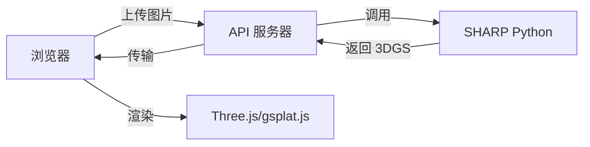
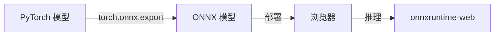
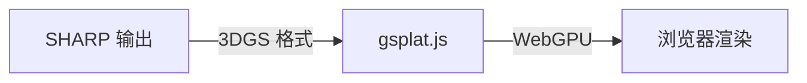
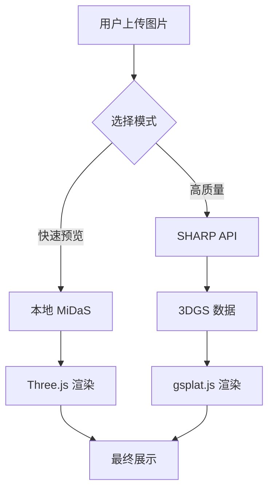

# 🔬 Apple SHARP 与 Immersa 3D 集成研究报告

**研究日期**: 2025-12-26  
**研究范围**: 技术架构对比、集成可行性、实施方案

---

## 1. 项目概览

### Apple SHARP

| 项目         | 说明                                                 |
| ------------ | ---------------------------------------------------- |
| **名称**     | SHARP (Sharp Monocular View Synthesis)               |
| **仓库**     | [apple/ml-sharp](https://github.com/apple/ml-sharp)  |
| **论文**     | [arXiv:2512.10685](https://arxiv.org/abs/2512.10685) |
| **发布日期** | 2025-12-12                                           |
| **许可**     | Apple 自定义许可                                     |

### Immersa 3D

| 项目         | 说明                         |
| ------------ | ---------------------------- |
| **名称**     | Immersa 3D                   |
| **类型**     | Web 应用（PWA）              |
| **当前版本** | 1.0.0                        |
| **技术栈**   | JavaScript + Three.js + ONNX |

---

## 2. 技术栈对比

### 核心技术差异

| 维度             | Apple SHARP           | Immersa 3D          |
| ---------------- | --------------------- | ------------------- |
| **语言**         | Python 3.13           | JavaScript (ES2022) |
| **深度学习框架** | PyTorch               | ONNX Runtime Web    |
| **3D 表示**      | 3D Gaussian Splatting | Three.js Mesh       |
| **渲染引擎**     | gsplat (CUDA)         | Three.js WebGL      |
| **运行环境**     | GPU 服务器            | 浏览器              |
| **推理时间**     | < 1 秒 (GPU)          | 实时 (WebGL)        |

### SHARP 依赖分析

```
核心依赖:
├── torch           # PyTorch 深度学习
├── torchvision     # 图像处理
├── gsplat          # 3D Gaussian Splatting 渲染
├── timm            # 预训练视觉模型
├── scipy           # 科学计算
├── imageio         # 图像/视频 I/O
└── plyfile         # PLY 格式支持
```

### Immersa 3D 依赖分析

```
核心依赖:
├── three           # 3D 渲染引擎
├── onnxruntime-web # ONNX 推理
├── @tensorflow/tfjs # TensorFlow.js
├── gsap            # 动画
└── @ffmpeg/*       # 视频处理
```

---

## 3. 架构对比

### SHARP 源码结构

```
src/sharp/
├── cli/           # 命令行工具
├── models/        # 核心模型
│   ├── predictor.py     # 高斯预测器
│   ├── composer.py      # 场景组合器
│   ├── alignment.py     # 对齐模块
│   ├── blocks.py        # 网络模块
│   ├── normalizers.py   # 归一化
│   └── params.py        # 参数配置
└── utils/         # 工具函数
```

### Immersa 3D AIEngine 结构

```
src/core/AIEngine/
├── DepthEstimator.js    # MiDaS 深度估计
├── ModelManager.js      # 模型管理
├── ModelDownloader.js   # 模型下载
├── SceneAnalyzer.js     # 场景分析
└── index.js             # 导出
```

---

## 4. 功能对比

### 核心能力对比

| 功能             | SHARP            | Immersa 3D  | 差异           |
| ---------------- | ---------------- | ----------- | -------------- |
| **单目深度估计** | ✅ 内置          | ✅ MiDaS    | SHARP 更精确   |
| **3D 重建**      | ✅ 3DGS          | ✅ Mesh     | SHARP 质量更高 |
| **视角合成**     | ✅ 核心功能      | ⚠️ 有限     | SHARP 大幅领先 |
| **实时渲染**     | ✅ gsplat        | ✅ Three.js | 不同技术路线   |
| **度量级精度**   | ✅ 绝对尺度      | ❌ 相对深度 | SHARP 有优势   |
| **浏览器运行**   | ❌ 需 GPU 服务器 | ✅ 原生支持 | Immersa 有优势 |

### 性能对比

| 指标           | SHARP        | Immersa 3D (MiDaS) |
| -------------- | ------------ | ------------------ |
| **推理时间**   | < 1 秒 (GPU) | ~300ms (WASM)      |
| **LPIPS**      | SOTA         | 一般               |
| **DISTS**      | SOTA         | 一般               |
| **零样本泛化** | ✅ 非常强    | ⚠️ 一般            |

---

## 5. 集成可行性分析

### 方案 A：后端 API 集成（推荐）



**优点**:

- ✅ 利用 SHARP 全部能力
- ✅ 高质量 3D 重建
- ✅ 浏览器端轻量化

**缺点**:

- ❌ 需要 GPU 服务器
- ❌ 网络延迟
- ❌ 运营成本

**实施复杂度**: ⭐⭐⭐ 中等

---

### 方案 B：ONNX 模型转换



**优点**:

- ✅ 纯浏览器运行
- ✅ 无服务器成本
- ✅ 离线支持

**缺点**:

- ❌ 模型可能过大 (>500MB)
- ❌ 需要模型转换工作
- ❌ 性能可能下降
- ❌ gsplat 渲染不可用

**实施复杂度**: ⭐⭐⭐⭐⭐ 极高

---

### 方案 C：WebGPU + gsplat.js



**优点**:

- ✅ 原生浏览器渲染
- ✅ 利用现代 GPU
- ✅ 可与 Three.js 集成

**缺点**:

- ❌ WebGPU 兼容性有限
- ❌ 需要后端预处理
- ⚠️ gsplat.js 尚不成熟

**实施复杂度**: ⭐⭐⭐⭐ 高

---

### 方案 D：混合架构（最佳平衡）



**优点**:

- ✅ 快速预览 + 高质量可选
- ✅ 利用现有 MiDaS 能力
- ✅ 渐进式增强
- ✅ 离线仍可用

**实施复杂度**: ⭐⭐⭐ 中等

---

## 6. 推荐实施路线图

### 阶段 1：API 集成（2-4 周）

| 任务                   | 工作量 | 输出                  |
| ---------------------- | ------ | --------------------- |
| 部署 SHARP Docker 容器 | 3 天   | GPU 服务端点          |
| 创建 REST API 封装     | 2 天   | FastAPI 服务          |
| 前端 API 调用模块      | 2 天   | `SharpClient.js`      |
| 3DGS 数据解析          | 3 天   | `GaussianLoader.js`   |
| Three.js 集成渲染      | 5 天   | `GaussianRenderer.js` |

### 阶段 2：gsplat.js 渲染（2-3 周）

| 任务            | 工作量 | 输出                |
| --------------- | ------ | ------------------- |
| 研究 gsplat.js  | 2 天   | 技术评估            |
| WebGPU 渲染器   | 5 天   | `WebGPURenderer.js` |
| Three.js 互操作 | 3 天   | 场景合并            |
| 性能优化        | 3 天   | 60fps 目标          |

### 阶段 3：模型优化（可选，4-6 周）

| 任务          | 工作量 | 输出         |
| ------------- | ------ | ------------ |
| ONNX 导出尝试 | 1 周   | 可行性验证   |
| 模型量化      | 1 周   | 体积减小     |
| WASM 部署     | 2 周   | 纯浏览器版本 |

---

## 7. 技术要点

### SHARP 输出格式

SHARP 输出 **3D Gaussian Splatting** 数据，包含：

| 参数          | 说明         | 数据类型        |
| ------------- | ------------ | --------------- |
| `positions`   | 高斯中心位置 | Float32 [N, 3]  |
| `covariances` | 协方差矩阵   | Float32 [N, 6]  |
| `colors`      | 球谐系数颜色 | Float32 [N, 48] |
| `opacities`   | 不透明度     | Float32 [N, 1]  |

### gsplat.js 集成示例

```javascript
import * as THREE from 'three';
import { GaussianSplatting } from 'gsplat.js'; // 假设库

class SharpRenderer {
  constructor(scene) {
    this.scene = scene;
    this.gaussians = null;
  }

  async loadFromAPI(imageUrl) {
    // 调用 SHARP API
    const response = await fetch('/api/sharp/predict', {
      method: 'POST',
      body: JSON.stringify({ image: imageUrl }),
    });

    const gaussianData = await response.arrayBuffer();

    // 创建 3DGS 渲染对象
    this.gaussians = new GaussianSplatting(gaussianData);
    this.scene.add(this.gaussians);
  }

  render(camera) {
    this.gaussians.update(camera);
  }
}
```

---

## 8. 风险与挑战

| 风险             | 等级  | 缓解措施         |
| ---------------- | ----- | ---------------- |
| GPU 服务器成本   | 🟡 中 | 使用按需实例     |
| SHARP 许可限制   | 🔴 高 | 需要确认商用条款 |
| 模型体积过大     | 🟡 中 | 服务端部署       |
| WebGPU 兼容性    | 🟡 中 | 回退到 WebGL     |
| gsplat.js 成熟度 | 🟡 中 | 持续关注社区     |

---

## 9. 成本估算

### 开发成本

| 阶段     | 人天      | 费用估算     |
| -------- | --------- | ------------ |
| 阶段 1   | 15 天     | ¥30,000      |
| 阶段 2   | 13 天     | ¥26,000      |
| 阶段 3   | 30 天     | ¥60,000      |
| **总计** | **58 天** | **¥116,000** |

### 运营成本（月度）

| 项目              | 费用           |
| ----------------- | -------------- |
| GPU 服务器 (A100) | ~¥5,000/月     |
| CDN 带宽          | ~¥500/月       |
| **总计**          | **~¥5,500/月** |

---

## 10. 结论与建议

### 总体评估

| 维度       | 评分       | 说明               |
| ---------- | ---------- | ------------------ |
| 技术可行性 | ⭐⭐⭐⭐   | 可行，需要后端支持 |
| 用户价值   | ⭐⭐⭐⭐⭐ | 极大提升 3D 质量   |
| 实施复杂度 | ⭐⭐⭐     | 中等               |
| ROI        | ⭐⭐⭐⭐   | 较高               |

### 建议

1. **短期（1-2 月）**:

   - 采用 **方案 D（混合架构）**
   - 先实现 API 集成，提供"高质量模式"

2. **中期（3-6 月）**:

   - 研究 gsplat.js 进展
   - 考虑 WebGPU 渲染集成

3. **长期（6-12 月）**:
   - 探索 ONNX 转换可能性
   - 关注 Apple 官方 Web 版本

### 下一步行动

- [ ] 阅读 SHARP 许可证条款
- [ ] 搭建 SHARP Docker 测试环境
- [ ] 设计 REST API 接口
- [ ] 研究 gsplat.js 库

---

> 📁 本报告存档于: `reports/SHARP_INTEGRATION_RESEARCH.md`
